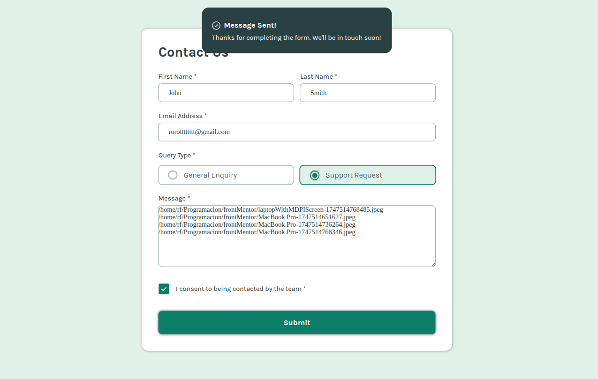

# Frontend Mentor - Contact form solution

This is a solution to the [Contact form challenge on Frontend Mentor](https://www.frontendmentor.io/challenges/contact-form--G-hYlqKJj). Frontend Mentor challenges help you improve your coding skills by building realistic projects. 

## Table of contents

- [Overview](#overview)
  - [The challenge](#the-challenge)
  - [Screenshot](#screenshot)
  - [Links](#links)
- [My process](#my-process)
  - [Built with](#built-with)
  - [What I learned](#what-i-learned)
  - [Continued development](#continued-development)
  - [Useful resources](#useful-resources)
- [Author](#author)
- [Acknowledgments](#acknowledgments)

**Note: Delete this note and update the table of contents based on what sections you keep.**

### Screenshot

- CSS custom properties
- Flexbox
- CSS Grid
- Mobile-first workflow
- Javascript w/modules
# Accessible Keyboard-Navigable Form

This project implements an accessible, keyboard-navigable web form. It allows users to navigate between form inputs—including grouped radio buttons—using `Tab`, `Shift+Tab`, and arrow keys, with visual feedback and modular JavaScript handling.

##  Features

- **Keyboard navigation** with support for `Tab`, `Shift + Tab`, `Arrow` keys.
- **Accessible form markup** with focus management.
- **Dynamic class toggling** based on interaction state.
- **Modular JavaScript structure** using ES6 modules.
- Lightweight, dependency-free implementation.

- [Example resource 1](https://www.example.com) - This helped me for XYZ reason. I really liked this pattern and will use it going forward.
- [Example resource 2](https://www.example.com) - This is an amazing article which helped me finally understand XYZ. I'd recommend it to anyone still learning this concept.

**Note: Delete this note and replace the list above with resources that helped you during the challenge. These could come in handy for anyone viewing your solution or for yourself when you look back on this project in the future.**

## Author

- Website - [Add your name here](https://www.your-site.com)
- Frontend Mentor - [@yourusername](https://www.frontendmentor.io/profile/yourusername)
